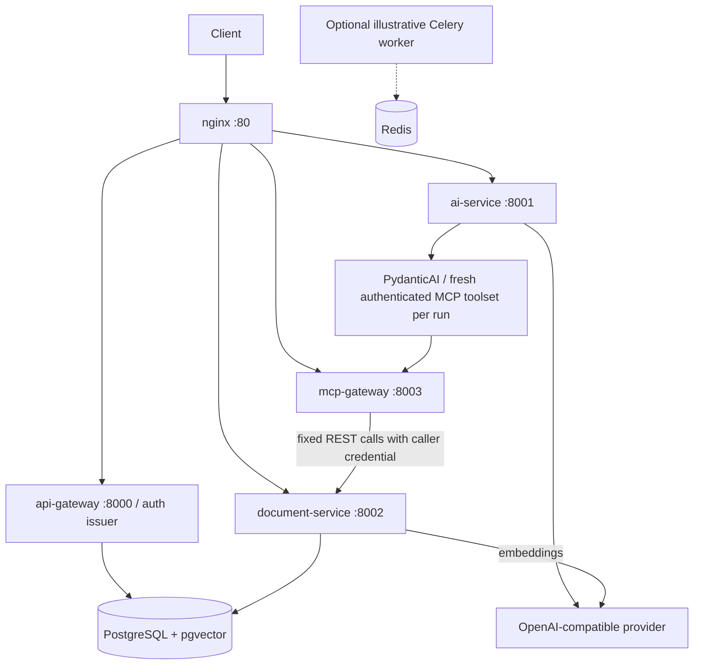

# AI Microservices Platform

A production-style reference platform for authenticated LLM inference, document
upload and semantic search, and a document assistant using MCP and PydanticAI.

[](https://github.com/mufazzalshokh/ai-microservices-platform/actions/workflows/ci.yml)

## Architecture



| Service | Responsibility |
| --- | --- |
| api-gateway | Registration, login, refresh, logout, profile, public JWKS; no downstream proxying |
| ai-service | Chat, inference streaming, templates, document-agent endpoint |
| document-service | Synchronous-in-request upload processing; own-user list/get/delete/search |
| mcp-gateway | Authenticated Streamable HTTP tools for document list/search |
| nginx | Route selection, streaming proxy, per-IP rate limiting |
| PostgreSQL + pgvector | User/token/document storage and cosine vector search |
| Redis / optional worker | Broker/result backend and illustrative task extensions |

Direct service ports 8000-8003 remain available for debugging. Compose binds exposed
ports to loopback. nginx sends auth, inference/agent, document, and MCP routes to
the appropriate service. Its `/health` checks nginx only.

## Authentication and trust

Symmetric signing would give every verifier signing capability, increasing the
impact of a compromised service. RS256 therefore separates signing from verification:
only the issuer mounts the private key; resource services mount public material only.
The worker receives no JWT key. Private material is excluded from Git and Docker builds.

Services check signature, a fixed RS256 algorithm, expiration, token type, issuer,
audience, unique `jti`, and required claims. The `kid` header identifies the configured
public key. `/.well-known/jwks.json` exposes public parameters only. Verification uses
local mounted keys, so it does not depend on the issuer being reachable for each request.

The default issuer is `http://localhost`; the single platform audience is `ai-platform`.
REST and MCP intentionally share this audience and enforce scopes independently.
This is not token exchange or a complete OAuth authorization server. MCP clients use
a bearer token obtained through `/api/v1/auth/login`; automatic OAuth login is absent.

| Permission | Operations |
| --- | --- |
| `profile:read` | Current profile |
| `ai:invoke` | Existing inference and template endpoints |
| `documents:read` | List/get documents; MCP list tool |
| `documents:write` | Upload/delete documents |
| `documents:search` | Semantic search; MCP search tool |
| `mcp:invoke` | MCP transport access |
| `ai:agent` | Agent endpoint, together with MCP and document read/search scopes |

The issuer grants this fixed ordinary-user scope set. There is no caller-controlled
scope grant or administrator permission. Missing/invalid credentials return 401;
insufficient scopes return 403. MCP tool denials use error results with a `Forbidden`
message; downstream authorization failures never become successful data.

Refresh tokens expire after seven days and rotate once; access tokens last 30 minutes.
Only refresh hashes are stored. Row locking serializes refresh attempts and replay of
a consumed token is rejected. Token-family revocation is not implemented. Logout
invalidates the supplied refresh token, while issued access tokens remain valid until
expiry. Password hashing uses bcrypt; new passwords are limited to 72 UTF-8 bytes.

## Document assistant

`POST /api/v1/agent/query` accepts `{"question": "What do my notes say about deployment?"}`
and returns an answer in the standard `data` envelope. PydanticAI uses MCP tools to
retrieve context, then generates the answer. Model/provider configuration is environment-driven.

The toolset is created once per run with a fresh HTTP client and the current user's
bearer token. Concurrent users never share an authenticated MCP session. MCP forwards
the token only to fixed document-service routes; identity comes from verified claims,
and database queries retain their ownership filters. There is no user-ID tool argument.

Retrieved text is untrusted data. Document instructions cannot change identity,
permissions, destinations, or ownership predicates. These boundaries are enforced by
code, regardless of model output. Answers can still be incorrect or influenced by
malicious content; authorization checks do not guarantee answer quality.

MCP requests and responses are bounded. Gateway-to-document calls have explicit
timeouts and disable redirects/retries. Agent runs have a deadline and call limits. Errors
returned to callers exclude raw provider/transport exception text and bearer tokens.

## Local setup

Use Python 3.11 or 3.12 and Docker Compose. Provider credentials are needed only for
live inference/embeddings; tests use deterministic models and mocked provider responses.

```bash
python -m venv .venv
# Linux/macOS: source .venv/bin/activate
# PowerShell: .venv/Scripts/Activate.ps1
python -m pip install -r requirements-dev.txt
python scripts/generate_keys.py
```

Copy `.env.example` to `.env` only if `.env` does not already exist. Set the database
password and provider key. Key generation refuses to overwrite either file, uses
3072-bit RSA, and sets private-file mode 0600 on POSIX. On Windows, protect the key
directory with your account's filesystem ACL. No key material is included in the repository.

On Linux set `LOCAL_UID` and `LOCAL_GID` to `id -u` and `id -g` in `.env`: file-backed
Compose secrets retain host ownership, so the issuer runs with that UID/GID to read
its 0600 private key. Other application images use their non-root application user.

For an existing installation, configure the new key paths and RS256 settings from
`.env.example`; old symmetric tokens cannot survive the migration. The existing `.env`
is never rewritten by setup. Changing keys requires restarting all resource services
and signing in again; automatic overlapping-key rotation is not provided.

```bash
docker compose --env-file .env.example --profile examples config --quiet
docker compose up --build
```

Public liveness/status endpoints exist on each service's `/health`. Compose's Python
stdlib checks require JSON `status: ok`; database degradation must not report healthy.
The optional worker uses a targeted Celery ping rather than an HTTP healthcheck.

## Try it through nginx

```bash
curl -X POST http://localhost/api/v1/auth/register   -H 'Content-Type: application/json'   -d '{"email":"user@example.com","password":"Password1"}'
curl -X POST http://localhost/api/v1/auth/login   -H 'Content-Type: application/json'   -d '{"email":"user@example.com","password":"Password1"}'

# Use data.access_token from login as TOKEN.
curl http://localhost/api/v1/documents/ -H "Authorization: Bearer $TOKEN"
curl -X POST http://localhost/api/v1/documents/upload   -H "Authorization: Bearer $TOKEN" -F 'file=@README.md'
curl -X POST http://localhost/api/v1/documents/search   -H "Authorization: Bearer $TOKEN" -H 'Content-Type: application/json'   -d '{"query":"deployment","limit":3}'
curl -X POST http://localhost/api/v1/agent/query   -H "Authorization: Bearer $TOKEN" -H 'Content-Type: application/json'   -d '{"question":"Summarize the deployment instructions in my documents"}'
```

MCP clients connect to `http://localhost/mcp` with the same Authorization header.
The tools are `list_documents()` and `search_documents(query, limit=5)`.
REST interactive docs remain at `http://localhost:8000/docs`, `:8001/docs`, and `:8002/docs`.

## Validation and CI

```bash
python -m pip check
python scripts/check.py
# Focused checks:
python -m pytest tests/ -q
python -m ruff check .
docker compose --env-file .env.example --profile examples config --quiet
```

`check.py` compiles Python, runs Ruff, checks shared/scripts and each service separately
with mypy, and runs pytest. The existing non-strict mypy policy is retained; checks
are separated because independent services use the same `app` package name. Python
3.11 is the minimum runtime/tool target, and both CI providers test 3.11 and 3.12.
Tests generate temporary RSA keys and need no real provider key, database, or Redis.

GitHub Actions and GitLab CI use the same Python gate plus Compose validation and
image builds. GitLab's container job needs a privileged Docker-in-Docker runner with
a shared `/certs/client` volume for TLS certificates. No provider secrets are required.
CI definitions alone do not establish that hosted pipelines passed.

## Limitations

- Upload extraction/chunking/embedding/storage runs in the HTTP request. Text and
  Markdown are supported; this is not an asynchronous document ingestion system.
- `docker compose --profile examples up worker` enables illustrative Celery tasks.
  Their status/summary/cleanup outputs do not represent persisted work. Beat schedules
  require a separate beat process; Redis already applies result expiry.
- One PostgreSQL database and application account are shared. Ownership is enforced
  in service SQL, not database roles or row-level security. A compromised service
  holding database credentials has a larger impact than a normal authenticated caller.
- pgvector keeps local infrastructure small. Capacity and index tuning need workload
  measurements; this project makes no vector-count scalability guarantee.
- nginx limits requests per IP (10/s, burst 20). Direct debug ports bypass this limit;
  there are no per-user inference quotas. Local HTTP must be replaced with TLS before
  remote deployment, and debug/database ports should remain private.
- No complete OAuth provider, key-rotation automation, access-token revocation,
  durable agent workflow, production migrations, or verified production readiness.

See [the security and MCP specification](docs/specs/authenticated-mcp.md) for the
contract and acceptance criteria, and [local validation evidence](docs/validation.md).
